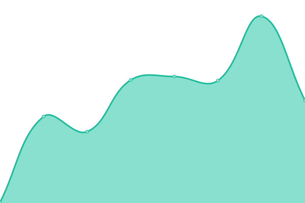
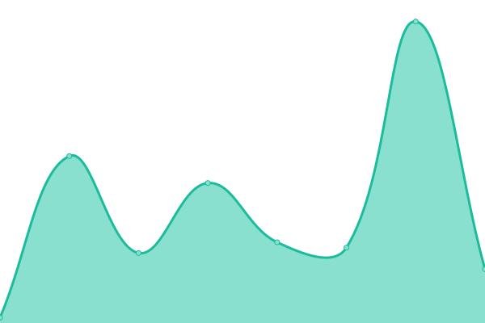
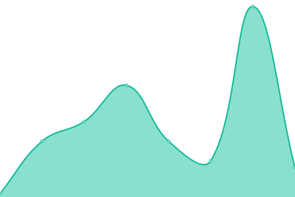
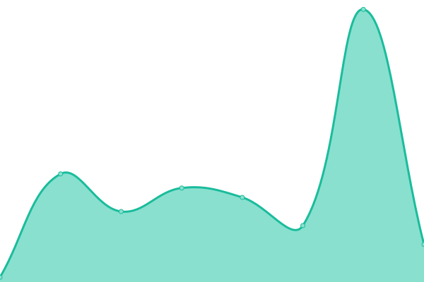

# [📈 Live Status](https://status.shinycolors.wiki): <!--live status--> **🟩 All systems operational**

This repository contains the open-source uptime monitor and status page for [ShinyColors.wiki](https://shinycolors.wiki), powered by [Upptime](https://github.com/upptime/upptime).

With [Upptime](https://upptime.js.org), you can get your own unlimited and free uptime monitor and status page, powered entirely by a GitHub repository. We use [Issues](https://github.com/ShinyColorsWiki/Status/issues) as incident reports, [Actions](https://github.com/ShinyColorsWiki/Status/actions) as uptime monitors, and [Pages](https://status.shinycolors.wiki) for the status page.

<!--start: status pages-->
<!-- This summary is generated by Upptime (https://github.com/upptime/upptime) -->
<!-- Do not edit this manually, your changes will be overwritten -->
<!-- prettier-ignore -->
| URL | Status | History | Response Time | Uptime |
| --- | ------ | ------- | ------------- | ------ |
|  [Wiki Page: "Main Page"](https://shinycolors.wiki/wiki/Main_Page) | 🟩 Up | [wiki-page-main-page.yml](https://github.com/ShinyColorsWiki/Status/commits/HEAD/history/wiki-page-main-page.yml) | 

 659ms
     
 | 

<a href="https://status.shinycolors.wiki/history/wiki-page-main-page">100.00%</a>
    

|  [Wiki Page: "Card List/Produce"](https://shinycolors.wiki/wiki/Card_List/Produce) | 🟩 Up | [wiki-page-card-list-produce.yml](https://github.com/ShinyColorsWiki/Status/commits/HEAD/history/wiki-page-card-list-produce.yml) | 

 646ms
     
 | 

<a href="https://status.shinycolors.wiki/history/wiki-page-card-list-produce">100.00%</a>
    

|  [Wiki Page: "Card List/Support"](https://shinycolors.wiki/wiki/Card_List/Support) | 🟩 Up | [wiki-page-card-list-support.yml](https://github.com/ShinyColorsWiki/Status/commits/HEAD/history/wiki-page-card-list-support.yml) | 

 602ms
     
 | 

<a href="https://status.shinycolors.wiki/history/wiki-page-card-list-support">100.00%</a>
    

|  [Wiki Page: "Gacha/Previous Gacha Banners"](https://shinycolors.wiki/wiki/Gacha/Previous_Gacha_Banners) | 🟩 Up | [wiki-page-gacha-previous-gacha-banners.yml](https://github.com/ShinyColorsWiki/Status/commits/HEAD/history/wiki-page-gacha-previous-gacha-banners.yml) | 

 520ms
     
 | 

<a href="https://status.shinycolors.wiki/history/wiki-page-gacha-previous-gacha-banners">99.37%</a>
    

<!--end: status pages-->

[**Visit our status website →**](https://status.shinycolors.wiki)

## 📄 License

- Powered by: [Upptime](https://github.com/upptime/upptime)
- Code: [MIT](./LICENSE) © [ShinyColors.wiki](https://shinycolors.wiki)
- Data in the `./history` directory: [Open Database License](https://opendatacommons.org/licenses/odbl/1-0/)
